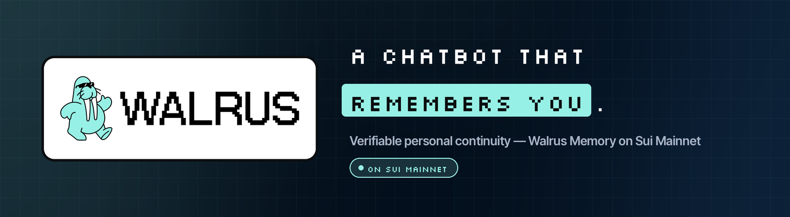
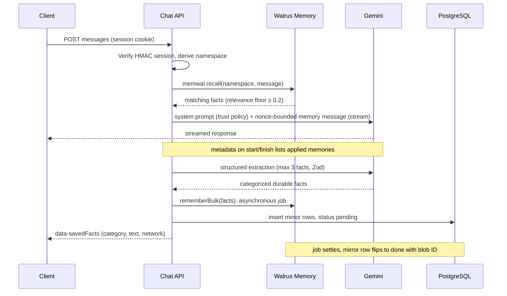
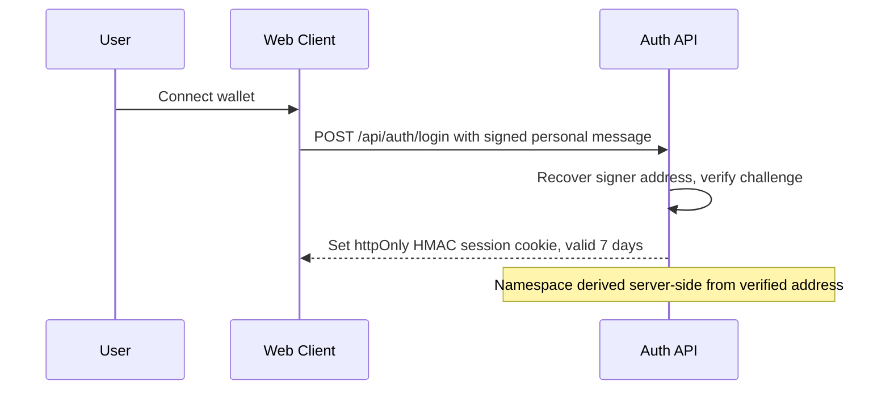
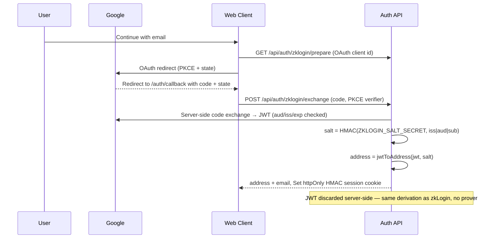

<p align="center">
  
</p>

# Mnemo AI

**Verifiable Personal Continuity Agent Powered by Walrus Memory on Sui Mainnet**

*An autonomous AI continuity agent that retains durable facts—projects, constraints, architectural decisions, and personal preferences—persisted to decentralized storage and semantically recalled across sessions, clients, and devices.*

[Architecture](#system-architecture) • [Core Capabilities](#core-capabilities) • [Getting Started](#getting-started) • [MCP Server](#model-context-protocol-mcp) • [API Reference](#api-reference)

---

## Summary

Most conversational interfaces operate with session-level amnesia. Every new conversation forces users to re-establish architectural constraints, historical decisions, and working contexts.

**Mnemo AI** addresses this limitation by functioning as an institutional continuity engine. Rather than storing unbounded, noisy chat transcripts, Mnemo employs a deterministic extraction and classification pipeline that identifies durable state primitives. These primitives are encrypted, anchored to Walrus Memory on Sui Mainnet, and semantically retrieved using vector similarity prior to every LLM generation.

Context is cryptographically tied to the user's verified Sui address — either a wallet signature or a Google sign-in mapped to a zkLogin-derived Sui address — ensuring complete multi-tenant isolation, cross-device portability, and client-agnostic interoperability via the Model Context Protocol (MCP).

---

## System Architecture

Mnemo decouples ephemeral interaction delivery from immutable state persistence. The PostgreSQL database serves exclusively as an ephemeral read-through UI mirror, while Walrus Memory acts as the decentralized source of truth.


---

## Core Capabilities

| Dimension | Engineering Implementation |
| :--- | :--- |
| **Cryptographic Multi-Tenancy** | Authentication accepts two sign-in paths, both resolving to a verified Sui address: a wallet personal-message challenge, or **Sui zkLogin address derivation** ("Continue with email" — Google OIDC; the address is derived server-side from the verified JWT, no proving service). The storage namespace is deterministically generated as `mnemo-user-{address}` from the verified signer. Clients cannot forge, switch, or inspect arbitrary namespaces. |
| **Categorical Fact Extraction** | Chat streams pass through a secondary evaluation stage using Google Gemini Flash and Zod schemas, filtering out conversational filler. Context is classified into four durable primitives: `project`, `constraint`, `decision`, or `preference`. |
| **Deterministic Vector Retrieval** | Before generating responses, semantic search queries the user namespace with a relevance floor of ≥ 0.2; if every hit falls below the floor, the nearest few are returned instead of nothing. Recalled facts are injected as a **separate user message** behind a per-request nonce boundary (`BEGIN_UNTRUSTED_WALRUS_MEMORY_…`), with a fixed untrusted-data policy in the system prompt — no memory byte ever holds system priority — plus strict grounding constraints to eliminate hallucinations. |
| **Vector Index Lag Mitigation** | Asynchronous decentralized writes (encrypt → upload → index) can introduce short replication latencies. Mnemo detects pending writes against the local mirror and executes a short linear backoff retry loop during retrieval, preventing empty recalls. |
| **Causal Evidence & Provenance** | The UI renders an active `[N] memories applied` chip on every contextual response. Expanding the chip reveals the exact stored memories alongside their cosine similarity relevance scores. |
| **A/B Counterfactual Testing** | An integrated **Memory ON/OFF** toggle on the chat interface bypasses recall injection and memory capture on demand, providing verifiable before-and-after demonstration proof. |
| **Decentralized Parity Audit** | The `/memory` interface reconciles the PostgreSQL mirror count directly against the Walrus Relayer's on-chain `listNamespaces()` metric to mathematically prove decentralized persistence. |

---

## Technology Stack

* **Core Framework:** Next.js 16 (App Router), React 19, TypeScript
* **Styling & Presentation:** Tailwind CSS 4, shadcn/ui, `next-themes` (Dark/Light high-contrast support)
* **Decentralized Memory Layer:** `@mysten-incubation/memwal` (Walrus Mainnet, Seal encryption, distributed vector index)
* **Intelligence Engine:** Google Gemini Flash via Vercel AI SDK (`ai`, `@ai-sdk/react`)
* **Identity & Authentication:** Sui Dapp-Kit (`@mysten/dapp-kit`) wallet challenges and **email sign-in** (Google OIDC Authorization Code + PKCE; the zkLogin address is derived server-side from the verified JWT — no ephemeral keypair, no proving service), HMAC session cookies
* **Persistence & Caching:** PostgreSQL (Serverless-compatible `pg` pool) for mirror state
* **Agent Interoperability:** Model Context Protocol (MCP) Streamable HTTP transport

---

## Getting Started

**Requirements:** Node ≥ 24 and a Postgres database (the mirror schema is created automatically on first query).

```bash
npm install
cp .env.example .env    # then fill in the values below
npm run dev             # http://localhost:3000 — serves the app and the API routes (same origin)
```

Minimum `.env` to sign in and chat:

| Variable | Purpose |
| :--- | :--- |
| `SESSION_SECRET` | Signs session cookies and MCP tokens — `openssl rand -hex 32` |
| `ZKLOGIN_SALT_SECRET` | Derives email sign-in addresses — `openssl rand -hex 32`, **never rotate** |
| `GEMINI_API_KEY` | Gemini Flash generation + fact extraction (free tier via Google AI Studio) |
| `DATABASE_URL` | Postgres URL, e.g. `postgres://mnemo@127.0.0.1:5433/mnemo` |

Optional: `MEMWAL_PRIVATE_KEY` + `MEMWAL_ACCOUNT_ID` (Walrus Memory indexing — without them chat still works and the dashboard reports `off`), `GOOGLE_CLIENT_ID` + `GOOGLE_CLIENT_SECRET` ("Continue with email" — wallet sign-in works without them).

Local Postgres, if you don't have one:

```bash
docker run -d --name mnemo-pg -p 5433:5433 -e POSTGRES_USER=mnemo -e POSTGRES_DB=mnemo postgres:17
```

`npm run dev:api` starts the standalone API server (`server/index.ts`, port 4000) — the same route handlers behind a bare HTTP server, used by the split deployment on Render. Local development doesn't need it.

---

## API Reference

| Method | Path | Authentication | Purpose |
| --- | --- | --- | --- |
| `POST` | `/api/chat` | Session cookie | Streams the assistant reply; recalls memories, extracts durable facts, persists them |
| `GET` | `/api/memory` | Session cookie | Mirror records, categorical counts, relayer cross-check, blob expiry summary, MCP endpoint and token |
| `GET` / `POST` | `/api/memory/expiry` | Session cookie or `Bearer $CRON_SECRET` | Reconciles the mirror against Sui and reports per-blob object ids and end epochs |
| `POST` | `/api/mcp` | Bearer (MCP token) | MCP Streamable HTTP: `initialize`, `tools/list`, `tools/call` |
| `GET` | `/api/mcp` | Bearer (MCP token) | `405` — clients must use `POST` |
| `DELETE` | `/api/mcp` | Bearer (MCP token) | `200` acknowledgement (stateless endpoint) |
| `POST` | `/api/auth/login` | — | Verifies the wallet challenge signature and sets the session cookie |
| `GET` | `/api/auth/zklogin/prepare` | — | Returns the OAuth client id used to build the Google sign-in redirect |
| `POST` | `/api/auth/zklogin/exchange` | — | Exchanges the OAuth code server-side, validates the JWT (`aud`/`iss`/`exp`), derives the zkLogin address from the HMAC salt, and sets the session cookie (the JWT never leaves the server) |
| `POST` | `/api/auth/logout` | Session cookie | Clears the session cookie |
| `GET` | `/api/auth/session` | Session cookie | Current address, namespace and email (`401` when signed out) |
| `GET` | `/api/health` | — | Liveness: relayer status, `relayer.auth` delegate-key probe (`true`/`false`, `null` until the first background probe lands after boot), database connectivity, LLM configuration, zkLogin sign-in configuration, Walrus blob lifetime |

### Conversational Endpoints

#### `POST /api/chat`

Streams assistant inference while retrieving and recording durable memory context.

* **Authentication:** HttpOnly session cookie (Sui wallet or Google sign-in).
* **Payload:** Vercel AI SDK `messages` array plus optional `forgetMode` flag (disables recall and saving for counterfactual runs).
* **Response:** A UI-message stream. The `start`/`finish` parts carry message metadata (`memories`, `recallAttempts`, `namespace`, `memoryEnabled`) describing exactly which memories shaped the reply; a `data-savedFacts` part reports the durable facts extracted and queued for persistence.



### Memory & State Management

#### `GET /api/memory`

Returns mirror records, categorical counts, and live Walrus network telemetry.

* **Authentication:** HttpOnly session cookie.
* **Response Body:**

```json
{
  "address": "0x3fa2bf883f7b91d7282488c377a270bfd81445de6acc9f711cda7fe544ac6b76",
  "namespace": "mnemo-user-0x3fa2bf883f7b91d7282488c377a270bfd81445de6acc9f711cda7fe544ac6b76",
  "mirrorCount": 14,
  "counts": { "project": 4, "constraint": 3, "decision": 3, "preference": 4 },
  "chain": { "count": 14, "storageBytes": 5020 },
  "expiry": {
    "anchored": 147,
    "unanchored": 0,
    "walrusEpoch": 40,
    "epochLengthDays": 14,
    "soonestExpiryEpoch": 47,
    "soonestExpiresAt": "2026-12-31T08:34:30.332Z",
    "epochsRemaining": 7,
    "daysRemaining": 98,
    "warn": false
  },
  "mcp": { "url": "https://mnemoai.xyz/api/mcp", "token": "mcp.0x3fa2…6b76.<hmac-token>" },
  "grouped": {
    "project": [
      {
        "id": "a2ba7282-bf37-45bb-9a59-5f5c69c67774",
        "category": "project",
        "text": "Project: Mnemo exposes a Streamable HTTP MCP endpoint so external agents can recall and remember its facts",
        "blobId": "TsIVjps0x5NGFIZIW0QoPZ37qQXldosdhy2uxXPPsEQ",
        "jobId": "fb131f95-0551-46d5-9ea4-d4e13530529a",
        "status": "done",
        "createdAt": "2026-09-26T06:43:40.865Z",
        "blobObjectId": "0x2a17…e9c4",
        "blobStartEpoch": 40,
        "blobExpiryEpoch": 55
      }
    ],
    "constraint": ["…"],
    "decision": ["…"],
    "preference": ["…"]
  }
}
```

`chain.count` is read live from the Walrus Relayer's `listNamespaces()` metric; equality with `mirrorCount` demonstrates that state exists onchain, not only in the local database.

`blobObjectId` / `blobStartEpoch` / `blobExpiryEpoch` come from the Walrus `Blob` object on Sui — the relayer transfers every blob it writes to the account owner, so the owner's object set is the on-chain truth. The route reconciles any unresolved rows on first load (read-only Sui GraphQL; a Sui hiccup degrades to "unresolved" rather than an error).

#### `GET /api/memory/expiry`

The expiry report a cron should poll. Every Walrus blob has a mandatory end epoch, and **a lapsed blob cannot be renewed or recovered** — the relayer only drops the index rows when it starts 404ing.

* **Authentication:** signed-in session **or** `Authorization: Bearer $CRON_SECRET`.
* **Behaviour:** forces a fresh Sui reconciliation, then reports per-blob end epochs, the epoch clock, and the object ids needed to renew.
* **Response:** the `expiry` object above plus `sync` (`fetched` / `linked`, with `renormalized` when rows needed blob-id canonicalization and `unlinked`, a sample of ids still unmatched), `byEpoch`, `blobs[]` (each with `objectId`, `expiryEpoch`, `expiresAt`, `epochsRemaining`, `warn`) and `renewWith.command`.
* **Renewal:** `walrus extend --blob-obj-id <blob_object_id>` — only possible **before** the end epoch, and only from the wallet that owns the blob objects (`MEMWAL_OWNER_ADDRESS`). Blobs are bought for 15 epochs (~7 months) and nothing extends them automatically.

**Cron:** `.github/workflows/expiry.yml` polls this endpoint daily at 06:17 UTC (and on demand via *Run workflow*), fails the job when `warn` flips true so the repo's notification settings email you, and warns when mirror rows are still unlinked to Sui. It needs two GitHub Actions entries — the same `MNEMO_API_URL` variable the keep-alive workflow uses, plus `CRON_SECRET` as a **secret** with the identical value to the Render env var:

*Settings ▸ Secrets and variables ▸ Actions ▸ Variables/Secrets*

The equivalent one-liner if you'd rather run your own cron:

```bash
curl -fsS -H "Authorization: Bearer $CRON_SECRET" https://mnemoai.xyz/api/memory/expiry
```

`warn` flips true within 3 epochs of the first expiry, and `GET /api/health` mirrors the same numbers under `walrus` so an uptime monitor can alert on it. The first call also backfills `blobObjectId` / `blobExpiryEpoch` for rows the dashboard has never reconciled.

---

## Model Context Protocol (MCP)

Mnemo natively implements the **Model Context Protocol** over Streamable HTTP, allowing IDE extensions, CLI agents, and developer tooling (e.g., Claude Code, Cursor, OpenCode) to read and write to the user's Walrus Memory layer.

### Available Tools

| Tool Signature | Parameters | Functionality |
| :--- | :--- | :--- |
| `mnemo_recall` | `query` (string), `limit` (int, default 6) | Executes semantic search across the user's encrypted decentralized memory. Returns matching facts and relevance scores. |
| `mnemo_remember` | `text` (string), `category` (enum, default `preference`) | Persists a durable fact directly to Walrus Memory Mainnet. Writes are permanent. |
| `mnemo_list_memories` | `category` (optional enum), `limit` (int, default 50) | Retrieves structured records from the mirror, filtered by category. |
| `mnemo_health` | *None* | Verifies connectivity across the Walrus relayer and vector indexer. |

### Integration Example

Configure your external AI development client using the endpoint and bearer token from the **Connect any AI agent — MCP** card on `/memory`:

```json
{
  "mcpServers": {
    "mnemo": {
      "type": "streamable-http",
      "url": "https://mnemoai.xyz/api/mcp",
      "headers": {
        "Authorization": "Bearer <mcp-token>"
      }
    }
  }
}
```

The namespace is derived from the token's HMAC-verified Sui address, so tool arguments can never address another user's memories. Rotating `SESSION_SECRET` revokes every issued token.

---

## Security Model

1. **Namespace Non-Forgeability:** Memory namespaces are derived exclusively on the server side from the verified signer address. Client-controlled payloads cannot access arbitrary namespaces — each user signs in with their own wallet **or zkLogin identity**, and memories are written to that address's namespace (see the [multi-tenant cookbook](https://docs.wal.app/walrus-memory/sdk/cookbook-multi-tenant)).
2. **Email Sign-In:** "Continue with email" uses Google OIDC (Authorization Code + PKCE). The OAuth code is exchanged server-side; the JWT, Google `aud`/`iss`/`exp` are validated on the server and the JWT never reaches the browser. The user's address is derived exactly as zkLogin specifies — `jwtToAddress(iss|aud|sub, HMAC-salt)` — and the session cookie is issued directly from that verified exchange, so **no proving service or allowlisted client ID is required**. Each user's salt is derived via HMAC from `ZKLOGIN_SALT_SECRET`, which is deliberately separate from `SESSION_SECRET` and **must never be rotated** — a different key would remap every email user to a fresh, empty namespace.
3. **Ephemeral Caches:** The PostgreSQL mirror contains no custodial private keys or raw authentication credentials. Rotating `SESSION_SECRET` instantly revokes all active web sessions and MCP bearer tokens without affecting zkLogin address derivation.
4. **Decentralized Encryption:** Memory payloads dispatched to the Walrus relayer are protected by threshold encryption (Seal protocol) prior to blob distribution across storage nodes.





---

## License

This project is licensed under the **MIT License** — see the [LICENSE](LICENSE) file for details.
