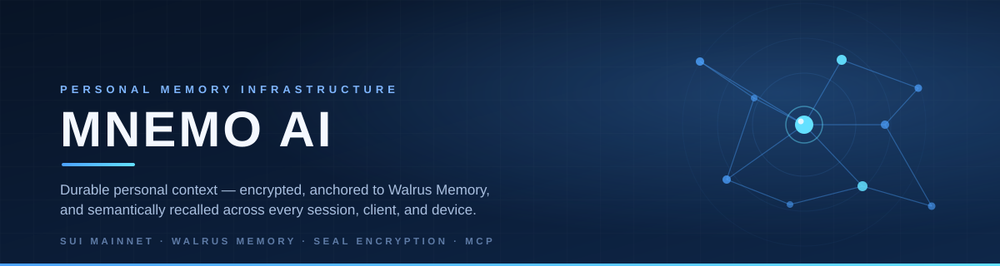
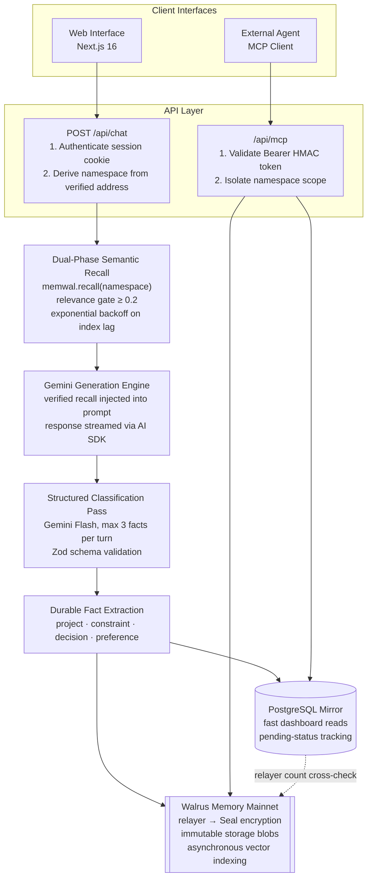
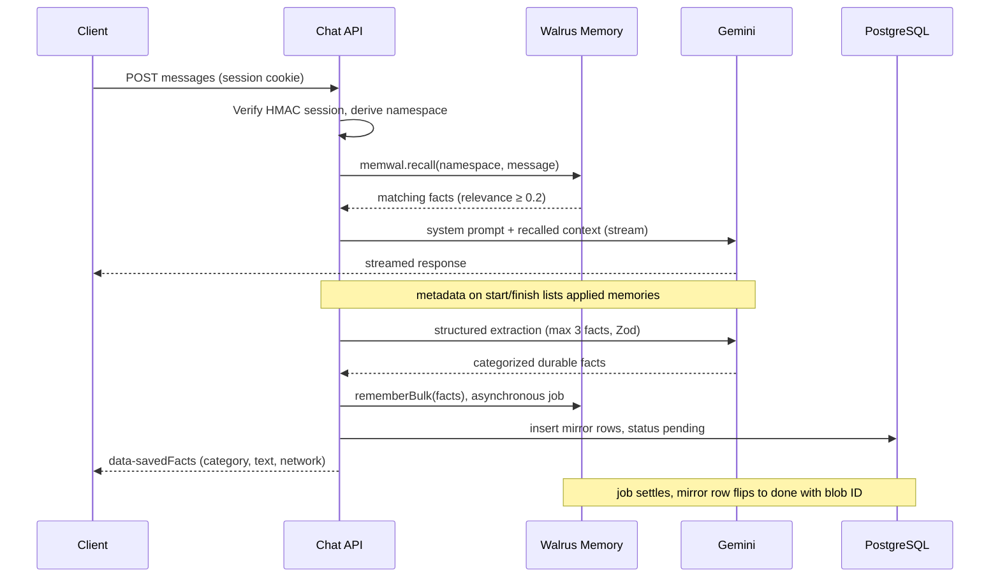
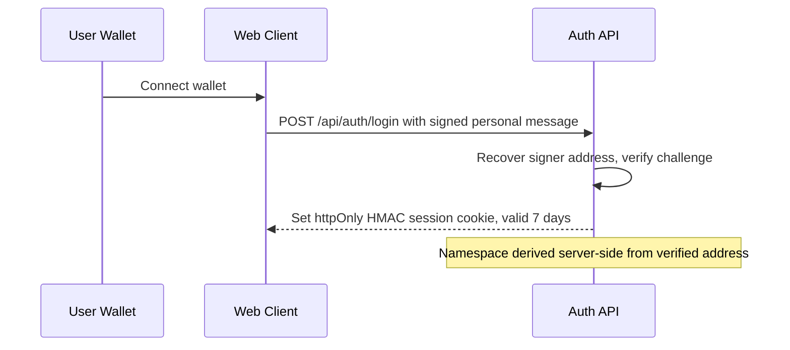
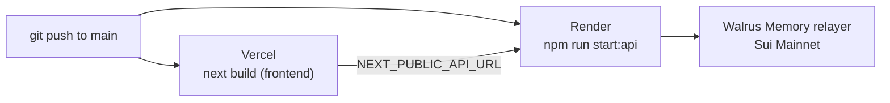

<p align="center">
  
</p>

<p align="center">
  
  
  
  
  
</p>

<p align="center">
  <a href="#system-architecture">Architecture</a> ·
  <a href="#core-capabilities">Core Capabilities</a> ·
  <a href="#getting-started">Quickstart</a> ·
  <a href="#model-context-protocol-mcp">MCP Server</a> ·
  <a href="#api-reference">API Reference</a> ·
  <a href="#deployment">Deployment</a>
</p>

---

## Executive Summary

Most conversational interfaces operate with session-level amnesia. Every new conversation forces users to re-establish architectural constraints, historical decisions, and working contexts.

**Mnemo AI** addresses this limitation by functioning as an institutional continuity engine. Rather than storing unbounded, noisy chat transcripts, Mnemo employs a deterministic extraction and classification pipeline that identifies durable state primitives. These primitives are encrypted, anchored to Walrus Memory on Sui Mainnet, and semantically retrieved using vector similarity prior to every LLM generation.

Context is cryptographically tied to the user's verified Sui wallet address, ensuring complete multi-tenant isolation, cross-device portability, and client-agnostic interoperability via the Model Context Protocol (MCP).

---

## System Architecture

Mnemo decouples ephemeral interaction delivery from immutable state persistence. The PostgreSQL database serves exclusively as an ephemeral read-through UI mirror, while Walrus Memory acts as the decentralized source of truth.



---

## Core Capabilities

| Dimension | Engineering Implementation |
| :--- | :--- |
| **Cryptographic Multi-Tenancy** | Authentication relies on Sui wallet personal-message challenge signatures verified server-side. The storage namespace is deterministically generated as `mnemo-user-{address}` from the verified signer. Clients cannot forge, switch, or inspect arbitrary namespaces. |
| **Categorical Fact Extraction** | Chat streams pass through a secondary evaluation stage using Google Gemini Flash and Zod schemas, filtering out conversational filler. Context is classified into four durable primitives: `project`, `constraint`, `decision`, or `preference`. |
| **Deterministic Vector Retrieval** | Before generating responses, semantic search queries the user namespace with a relevance cutoff of ≥ 0.2. Context is dynamically prepended to the system prompt with strict grounding constraints to eliminate hallucinations. |
| **Vector Index Lag Mitigation** | Asynchronous decentralized writes (encrypt → upload → index) can introduce short replication latencies. Mnemo detects pending writes against the local mirror and executes an exponential backoff retry loop during retrieval, preventing empty recalls. |
| **Causal Evidence & Provenance** | The UI renders an active `[N] memories applied` chip on every contextual response. Expanding the chip reveals the exact stored memories alongside their cosine similarity relevance scores. |
| **A/B Counterfactual Testing** | An integrated **Memory ON/OFF** toggle on the chat interface bypasses recall injection and memory capture on demand, providing verifiable before-and-after demonstration proof. |
| **Decentralized Parity Audit** | The `/memory` interface reconciles the PostgreSQL mirror count directly against the Walrus Relayer's on-chain `listNamespaces()` metric to mathematically prove decentralized persistence. |

---

## Technology Stack

* **Core Framework:** Next.js 16 (App Router), React 19, TypeScript
* **Styling & Presentation:** Tailwind CSS 4, shadcn/ui, `next-themes` (Dark/Light high-contrast support)
* **Decentralized Memory Layer:** `@mysten-incubation/memwal` (Walrus Mainnet, Seal encryption, distributed vector index)
* **Intelligence Engine:** Google Gemini Flash via Vercel AI SDK (`ai`, `@ai-sdk/react`)
* **Identity & Authentication:** Sui Dapp-Kit (`@mysten/dapp-kit`), Ed25519 signature challenges, HMAC session cookies
* **Persistence & Caching:** PostgreSQL (Serverless-compatible `pg` pool) for mirror state
* **Agent Interoperability:** Model Context Protocol (MCP) Streamable HTTP transport

---

## Getting Started

### Prerequisites

* **Node.js:** `v24.0.0` or higher
* **PostgreSQL:** Neon Serverless, Supabase, or standard local instance (used solely for UI mirror performance)
* **Walrus Memory Credentials:** Account ID and Ed25519 delegate key provisioned via [Walrus Memory Portal](https://memory.walrus.xyz)
* **Gemini API Key:** Obtained from [Google AI Studio](https://aistudio.google.com/apikey)

### Installation

1. **Clone the repository:**
   ```bash
   git clone https://github.com/mianohh/mnemo.git
   cd mnemo
   ```

2. **Install project dependencies:**
   ```bash
   npm install
   ```

3. **Configure environment settings:**
   ```bash
   cp .env.example .env
   ```

4. **Add your credentials to `.env`:**
   Fill in the [required variables](#configuration-reference) — at minimum `DATABASE_URL`, `SESSION_SECRET`, and `GEMINI_API_KEY`. The database schema is created automatically the first time the app touches the database.

5. **Start the development server:**
   ```bash
   npm run dev
   ```
   Chat is served at `http://localhost:3000` and the memory dashboard at `http://localhost:3000/memory`. Sign in with any Sui wallet.

   To exercise the split-deploy path locally, run the API in a second terminal and point the frontend at it:
   ```bash
   npm run dev:api
   NEXT_PUBLIC_API_URL=http://localhost:4000 npm run dev
   ```
   Leave `NEXT_PUBLIC_API_URL` empty to keep everything same-origin (the default).

---

## Configuration Reference

| Environment Variable | Requirement | Default | Description |
| :--- | :--- | :--- | :--- |
| `DATABASE_URL` | **Required** | — | PostgreSQL connection string for the UI dashboard mirror. |
| `SESSION_SECRET` | **Required** | — | 32-byte hex secret (`openssl rand -hex 32`) for HMAC session cookies and MCP bearer tokens. |
| `GEMINI_API_KEY` | **Required** | — | Google AI Studio key powering chat inference and structured extraction. |
| `MEMWAL_PRIVATE_KEY` | Required (production) | — | Ed25519 delegate private key (hex) authorized on Walrus Memory. |
| `MEMWAL_ACCOUNT_ID` | Required (production) | — | Sui Object ID (`0x…`) referencing the active `MemWalAccount`. |
| `MEMWAL_SERVER_URL` | Optional | `https://relayer.memory.walrus.xyz` | Endpoint for the Walrus Memory relayer service. |
| `MEMWAL_NETWORK` | Optional | `mainnet` | Target deployment environment (`mainnet` \| `testnet`). |
| `MEMWAL_MIN_RELEVANCE` | Optional | `0.2` | Semantic cosine similarity threshold for vector retrieval. |
| `GEMINI_MODEL` | Optional | `gemini-flash-lite-latest` | Gemini model variant used for generation and classification. |
| `NEXT_PUBLIC_SUI_RPC_URL` | Optional | *Public Mainnet* | Sui JSON-RPC endpoint for client-side wallet signatures. |
| `NEXT_PUBLIC_API_URL` | Required (split deploy) | *(same origin)* | Absolute URL of the Render API — set on Vercel only. |
| `CORS_ORIGINS` | Required (Render) | — | Comma-separated frontend origins allowed to call the API. |

> **Note:** If `MEMWAL_*` credentials are not supplied, Mnemo initializes in development sandbox mode. Memory capabilities gracefully deactivate, and the UI status reports `memwal: unconfigured`.

---

## Repository Structure

```text
src/
├── app/
│   ├── layout.tsx                    # Root layout, theme and wallet providers
│   ├── page.tsx                      # Primary chat interface & counterfactual switch
│   ├── memory/page.tsx               # Context timeline, category filters, and state auditor
│   ├── api/chat/route.ts             # Execution pipeline: Recall → Stream → Extract → Persist
│   ├── api/memory/route.ts           # Mirror retrieval, relayer cross-check, MCP tokens
│   ├── api/mcp/route.ts              # Stateless Streamable HTTP MCP server handler
│   ├── api/auth/login/route.ts       # Sui signature validation & session minting
│   ├── api/auth/logout/route.ts      # Session destruction
│   ├── api/auth/session/route.ts     # Active namespace and wallet introspection
│   └── api/health/route.ts           # Infrastructure health probe (relayer, DB, LLM)
├── components/
│   ├── chat/
│   │   ├── chat-client.tsx           # Chat runtime, toast dispatch, memory toggles
│   │   └── memory-indicator.tsx      # Interactive recall chip & provenance popover
│   ├── memory/memory-dashboard.tsx   # State visualization, category distributions
│   ├── auth-context.tsx              # Session state, sign-in/out, forget mode
│   ├── sign-in-gate.tsx              # Landing hero shown while signed out
│   ├── site-header.tsx               # Wallet connector, session status, theme controls
│   ├── theme-provider.tsx            # next-themes (light/dark/system)
│   ├── theme-toggle.tsx              # Theme switch control
│   ├── wallet-connect-button.tsx     # Connect / sign-in control
│   ├── wallet-providers.tsx          # Sui Dapp-Kit provider configuration
│   └── ui/                           # shadcn/ui primitives
└── lib/
    ├── sui.ts                        # Address manipulation and namespace derivation
    ├── sui-auth.ts                   # Cryptographic verification and token signing
    ├── mcp.ts                        # MCP server tool definitions and execution
    ├── chat-types.ts                 # UIMessage metadata and data-part types
    ├── llm.ts                        # Gemini client configuration
    ├── api.ts                        # Backend base URL and credentialed fetch helper
    ├── http.ts                       # Request cookie parsing and session cookie helpers
    ├── memory/
    │   ├── client.ts                 # MemWal singleton client wrapper
    │   ├── recall.ts                 # Semantic search and backoff retry logic
    │   ├── save.ts                   # Asynchronous bulk persistence and mirror sync
    │   ├── extract.ts                # Zod-based categorical fact extraction
    │   ├── prompt.ts                 # Memory-grounded system prompts
    │   ├── store.ts                  # Connection pool for PostgreSQL mirror
    │   └── types.ts                  # Shared memory-layer types
    └── utils.ts                      # Shared helper utilities
server/
└── index.ts                          # Standalone API server (Render entry point)
render.yaml                           # Render service blueprint
```

---

## API Reference

| Method | Path | Authentication | Purpose |
| --- | --- | --- | --- |
| `POST` | `/api/chat` | Session cookie | Streams the assistant reply; recalls memories, extracts durable facts, persists them |
| `GET` | `/api/memory` | Session cookie | Mirror records, categorical counts, relayer cross-check, MCP endpoint and token |
| `POST` | `/api/mcp` | Bearer (MCP token) | MCP Streamable HTTP: `initialize`, `tools/list`, `tools/call` |
| `GET` | `/api/mcp` | Bearer (MCP token) | `405` — clients must use `POST` |
| `DELETE` | `/api/mcp` | Bearer (MCP token) | `200` acknowledgement (stateless endpoint) |
| `POST` | `/api/auth/login` | — | Verifies the wallet challenge signature and sets the session cookie |
| `POST` | `/api/auth/logout` | Session cookie | Clears the session cookie |
| `GET` | `/api/auth/session` | Session cookie | Current address and namespace (`401` when signed out) |
| `GET` | `/api/health` | — | Liveness: relayer status, database connectivity, LLM configuration |

### Conversational Endpoints

#### `POST /api/chat`

Streams assistant inference while retrieving and recording durable memory context.

* **Authentication:** HttpOnly session cookie (authenticated Sui wallet).
* **Payload:** Vercel AI SDK `messages` array plus optional `forgetMode` flag (disables recall and saving for counterfactual runs).
* **Response:** A UI-message stream. The `start`/`finish` parts carry message metadata (`memories`, `recallAttempts`, `namespace`, `memoryEnabled`) describing exactly which memories shaped the reply; a `data-savedFacts` part reports the durable facts extracted and queued for persistence.



### Memory & State Management

#### `GET /api/memory`

Returns mirror records, categorical counts, and live Walrus network telemetry.

* **Authentication:** HttpOnly session cookie.
* **Response Body:**

```json
{
  "address": "0x3fa2bf883f7b91d7282488c377a270bfd81445de6acc9f711cda7fe544ac6b76",
  "namespace": "mnemo-user-0x3fa2bf883f7b91d7282488c377a270bfd81445de6acc9f711cda7fe544ac6b76",
  "mirrorCount": 14,
  "counts": { "project": 4, "constraint": 3, "decision": 3, "preference": 4 },
  "chain": { "count": 14, "storageBytes": 5020 },
  "mcp": { "url": "https://mnemo.app/api/mcp", "token": "mcp.0x3fa2…6b76.<hmac-token>" },
  "grouped": {
    "project": [
      {
        "id": "a2ba7282-bf37-45bb-9a59-5f5c69c67774",
        "category": "project",
        "text": "Project: Mnemo exposes a Streamable HTTP MCP endpoint so external agents can recall and remember its facts",
        "blobId": "TsIVjps0x5NGFIZIW0QoPZ37qQXldosdhy2uxXPPsEQ",
        "jobId": "fb131f95-0551-46d5-9ea4-d4e13530529a",
        "status": "done",
        "createdAt": "2026-09-26T06:43:40.865Z"
      }
    ],
    "constraint": ["…"],
    "decision": ["…"],
    "preference": ["…"]
  }
}
```

`chain.count` is read live from the Walrus Relayer's `listNamespaces()` metric; equality with `mirrorCount` demonstrates that state exists onchain, not only in the local database.

---

## Model Context Protocol (MCP)

Mnemo natively implements the **Model Context Protocol** over Streamable HTTP, allowing IDE extensions, CLI agents, and developer tooling (e.g., Claude Code, Cursor, OpenCode) to read and write to the user's Walrus Memory layer.

### Available Tools

| Tool Signature | Parameters | Functionality |
| :--- | :--- | :--- |
| `mnemo_recall` | `query` (string), `limit` (int, default 6) | Executes semantic search across the user's encrypted decentralized memory. Returns matching facts and relevance scores. |
| `mnemo_remember` | `text` (string), `category` (enum, default `preference`) | Persists a durable fact directly to Walrus Memory Mainnet. Writes are permanent. |
| `mnemo_list_memories` | `category` (optional enum), `limit` (int, default 50) | Retrieves structured records from the mirror, filtered by category. |
| `mnemo_health` | *None* | Verifies connectivity across the Walrus relayer and vector indexer. |

### Integration Example

Configure your external AI development client using the endpoint and bearer token from the **Connect any AI agent — MCP** card on `/memory`:

```json
{
  "mcpServers": {
    "mnemo": {
      "type": "streamable-http",
      "url": "https://mnemo.app/api/mcp",
      "headers": {
        "Authorization": "Bearer <mcp-token>"
      }
    }
  }
}
```

The namespace is derived from the token's HMAC-verified Sui address, so tool arguments can never address another user's memories. Rotating `SESSION_SECRET` revokes every issued token.

---

## Security Model

1. **Namespace Non-Forgeability:** Memory namespaces are derived exclusively on the server side via cryptographic address recovery. Client-controlled payloads cannot access arbitrary namespaces — each user signs in with their own wallet, and memories are written to that wallet's namespace (see the [multi-tenant cookbook](https://docs.wal.app/walrus-memory/sdk/cookbook-multi-tenant)).
2. **Ephemeral Caches:** The PostgreSQL mirror contains no custodial private keys or raw authentication credentials. Rotating `SESSION_SECRET` instantly revokes all active web sessions and MCP bearer tokens.
3. **Decentralized Encryption:** Memory payloads dispatched to the Walrus relayer are protected by threshold encryption (Seal protocol) prior to blob distribution across storage nodes.



---

## Deployment

The API runs as a standalone Node server on **Render**; the Next.js frontend runs on **Vercel** and calls the API cross-origin.



### 1. Push the repository

```bash
git branch -M main
git remote add origin https://github.com/mianohh/mnemo.git
git push -u origin main
```

### 2. Backend on Render

1. [render.com/new](https://render.com/new) → **Blueprint** → import the repository; `render.yaml` defines the service (`npm ci` → `npm run start:api`, health check `/api/health`).
2. Set the secrets in the service dashboard (marked *sync: false* in `render.yaml`):

   | Variable | Value |
   | --- | --- |
   | `SESSION_SECRET` | `openssl rand -hex 32` — generate once and never rotate |
   | `DATABASE_URL` | Postgres connection string (e.g. Neon) |
   | `GEMINI_API_KEY` | Google AI Studio key |
   | `MEMWAL_PRIVATE_KEY` / `MEMWAL_ACCOUNT_ID` | Walrus Memory delegate key and account ID |
   | `CORS_ORIGINS` | Your Vercel URL, e.g. `https://mnemo.vercel.app` |

3. Deploy — `https://<service>.onrender.com/api/health` returns `{"ok":true,…}`.

### 3. Frontend on Vercel

1. [vercel.com/new](https://vercel.com/new) — import the repository. The framework is detected automatically (**Next.js**, build command `next build`).
2. Project → **Settings → Environment Variables**:

   | Variable | Value |
   | --- | --- |
   | `NEXT_PUBLIC_API_URL` | `https://<service>.onrender.com` |
   | `NEXT_PUBLIC_SUI_RPC_URL` | optional — defaults to the public mainnet fullnode |

3. Deploy by pushing to `main`, or from **Deployments → Redeploy**. After the first deploy, add the final Vercel domain to `CORS_ORIGINS` on Render if it differs from the placeholder.

### 4. Post-deploy verification

1. `https://<service>.onrender.com/api/health` returns `{"ok":true,…,"database":true,…}`.
2. Open the Vercel URL, connect a wallet and sign the challenge (the session cookie is valid for seven days).
3. State a durable fact — e.g. *"I prefer bullet points over paragraphs"* — and wait for the **New context anchored to Mainnet** toast.
4. Ask *"What do you remember about me?"* — the `[N] memories applied` chip lists the recalled fact with its relevance score.
5. Refresh `/memory`: the new row transitions `pending → done` with its blob ID, and the badge reads **mirror matches the relayer ✓** to confirm onchain parity.
6. Copy the MCP endpoint and bearer token from the **Connect any AI agent — MCP** card, connect an MCP client, and call `mnemo_health`, `mnemo_remember`, and `mnemo_recall`.

### Troubleshooting

| Symptom | Fix |
| --- | --- |
| Browser console shows blocked CORS / `Origin not allowed` | `CORS_ORIGINS` on Render does not include the exact Vercel origin (scheme + host, no trailing slash) |
| Sign-in succeeds but `/api/memory` and chat return `401` | The session cookie was rejected — confirm both platforms serve HTTPS and `SESSION_SECRET` matches |
| `/memory` errors or counts stay at 0 | `DATABASE_URL` is missing or unreachable on Render — check the service environment |
| `memwal: unconfigured` | `MEMWAL_PRIVATE_KEY` / `MEMWAL_ACCOUNT_ID` are not set |
| MCP `401` | The token was issued for a different `SESSION_SECRET` — copy a fresh token from `/memory` |
| Wallet sign-in returns `401` | The Render logs contain `[mnemo] verifySignIn failed {…}` with the detected signature scheme |

---

## Design Notes: Manual `recall()` instead of `withMemWal()`

Walrus ships a drop-in middleware (`withMemWal`) that recalls before generation and saves afterwards. Mnemo performs both steps explicitly in order to:

1. **Show its work** — the UI needs the list of applied memories, which the middleware does not expose.
2. **Categorize before storing** — facts are grouped by type in the dashboard.
3. **Retry on index lag** — the UI reports when the vector index has not yet caught up.

The same primitives are used (`recall`, `rememberBulk`, `waitForRememberJob`) in approximately forty additional lines: see `src/lib/memory/`.

---

## Limitations

* **No deletion:** The Walrus Memory SDK exposes no delete API (neither per fact nor per namespace). `mnemo_remember` writes are permanent; a corrected fact is stored as a new memory, and the system prompt instructs the model to trust the user's most recent statement.
* **Conservative extraction:** At most three facts are extracted per conversational turn and only if they pass the durability filter — small talk and ephemeral details are deliberately dropped.
* **Eventual settlement:** `remember()` returns immediately; the mirror row shows `pending` until the encrypt → upload → index job settles (typically seconds). Recall compensates with backoff retries during that window, so counts and chips can lag the write by a few seconds.
* **Memory requires credentials:** Without `MEMWAL_*` variables the application runs in sandbox mode with memory disabled and the dashboard reports `memwal: unconfigured`.

---

## License

This project is licensed under the **MIT License** — see the [LICENSE](LICENSE) file for details.
