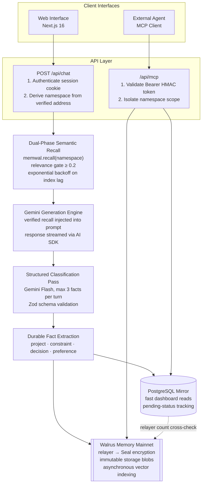
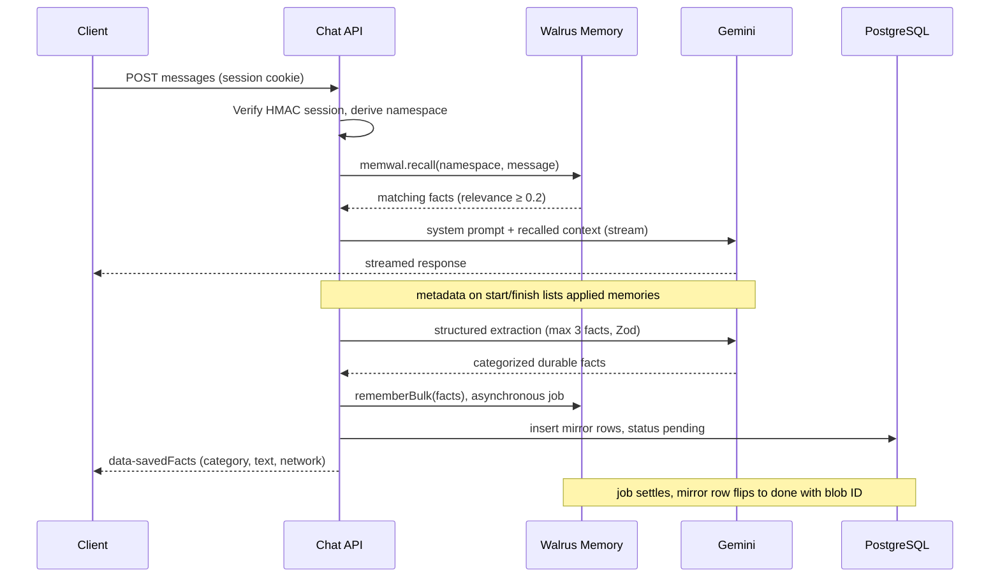
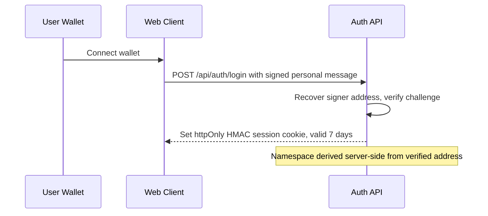

# Mnemo AI

**Verifiable Personal Continuity Agent Powered by Walrus Memory on Sui Mainnet**

*An autonomous AI continuity agent that retains durable facts—projects, constraints, architectural decisions, and personal preferences—persisted to decentralized storage and semantically recalled across sessions, clients, and devices.*

[Architecture](#system-architecture) • [Core Capabilities](#core-capabilities) • [Quickstart](#getting-started) • [MCP Server](#model-context-protocol-mcp) • [API Reference](#api-reference) • [Deployment](#deployment)

---

## Summary

Most conversational interfaces operate with session-level amnesia. Every new conversation forces users to re-establish architectural constraints, historical decisions, and working contexts.

**Mnemo AI** addresses this limitation by functioning as an institutional continuity engine. Rather than storing unbounded, noisy chat transcripts, Mnemo employs a deterministic extraction and classification pipeline that identifies durable state primitives. These primitives are encrypted, anchored to Walrus Memory on Sui Mainnet, and semantically retrieved using vector similarity prior to every LLM generation.

Context is cryptographically tied to the user's verified Sui wallet address, ensuring complete multi-tenant isolation, cross-device portability, and client-agnostic interoperability via the Model Context Protocol (MCP).

---

## System Architecture

Mnemo decouples ephemeral interaction delivery from immutable state persistence. The PostgreSQL database serves exclusively as an ephemeral read-through UI mirror, while Walrus Memory acts as the decentralized source of truth.



---

## Core Capabilities

| Dimension | Engineering Implementation |
| :--- | :--- |
| **Cryptographic Multi-Tenancy** | Authentication relies on Sui wallet personal-message challenge signatures verified server-side. The storage namespace is deterministically generated as `mnemo-user-{address}` from the verified signer. Clients cannot forge, switch, or inspect arbitrary namespaces. |
| **Categorical Fact Extraction** | Chat streams pass through a secondary evaluation stage using Google Gemini Flash and Zod schemas, filtering out conversational filler. Context is classified into four durable primitives: `project`, `constraint`, `decision`, or `preference`. |
| **Deterministic Vector Retrieval** | Before generating responses, semantic search queries the user namespace with a relevance cutoff of ≥ 0.2. Context is dynamically prepended to the system prompt with strict grounding constraints to eliminate hallucinations. |
| **Vector Index Lag Mitigation** | Asynchronous decentralized writes (encrypt → upload → index) can introduce short replication latencies. Mnemo detects pending writes against the local mirror and executes an exponential backoff retry loop during retrieval, preventing empty recalls. |
| **Causal Evidence & Provenance** | The UI renders an active `[N] memories applied` chip on every contextual response. Expanding the chip reveals the exact stored memories alongside their cosine similarity relevance scores. |
| **A/B Counterfactual Testing** | An integrated **Memory ON/OFF** toggle on the chat interface bypasses recall injection and memory capture on demand, providing verifiable before-and-after demonstration proof. |
| **Decentralized Parity Audit** | The `/memory` interface reconciles the PostgreSQL mirror count directly against the Walrus Relayer's on-chain `listNamespaces()` metric to mathematically prove decentralized persistence. |

---

## Technology Stack

* **Core Framework:** Next.js 16 (App Router), React 19, TypeScript
* **Styling & Presentation:** Tailwind CSS 4, shadcn/ui, `next-themes` (Dark/Light high-contrast support)
* **Decentralized Memory Layer:** `@mysten-incubation/memwal` (Walrus Mainnet, Seal encryption, distributed vector index)
* **Intelligence Engine:** Google Gemini Flash via Vercel AI SDK (`ai`, `@ai-sdk/react`)
* **Identity & Authentication:** Sui Dapp-Kit (`@mysten/dapp-kit`), Ed25519 signature challenges, HMAC session cookies
* **Persistence & Caching:** PostgreSQL (Serverless-compatible `pg` pool) for mirror state
* **Agent Interoperability:** Model Context Protocol (MCP) Streamable HTTP transport

---

## API Reference

| Method | Path | Authentication | Purpose |
| --- | --- | --- | --- |
| `POST` | `/api/chat` | Session cookie | Streams the assistant reply; recalls memories, extracts durable facts, persists them |
| `GET` | `/api/memory` | Session cookie | Mirror records, categorical counts, relayer cross-check, MCP endpoint and token |
| `POST` | `/api/mcp` | Bearer (MCP token) | MCP Streamable HTTP: `initialize`, `tools/list`, `tools/call` |
| `GET` | `/api/mcp` | Bearer (MCP token) | `405` — clients must use `POST` |
| `DELETE` | `/api/mcp` | Bearer (MCP token) | `200` acknowledgement (stateless endpoint) |
| `POST` | `/api/auth/login` | — | Verifies the wallet challenge signature and sets the session cookie |
| `POST` | `/api/auth/logout` | Session cookie | Clears the session cookie |
| `GET` | `/api/auth/session` | Session cookie | Current address and namespace (`401` when signed out) |
| `GET` | `/api/health` | — | Liveness: relayer status, database connectivity, LLM configuration |

### Conversational Endpoints

#### `POST /api/chat`

Streams assistant inference while retrieving and recording durable memory context.

* **Authentication:** HttpOnly session cookie (authenticated Sui wallet).
* **Payload:** Vercel AI SDK `messages` array plus optional `forgetMode` flag (disables recall and saving for counterfactual runs).
* **Response:** A UI-message stream. The `start`/`finish` parts carry message metadata (`memories`, `recallAttempts`, `namespace`, `memoryEnabled`) describing exactly which memories shaped the reply; a `data-savedFacts` part reports the durable facts extracted and queued for persistence.



### Memory & State Management

#### `GET /api/memory`

Returns mirror records, categorical counts, and live Walrus network telemetry.

* **Authentication:** HttpOnly session cookie.
* **Response Body:**

```json
{
  "address": "0x3fa2bf883f7b91d7282488c377a270bfd81445de6acc9f711cda7fe544ac6b76",
  "namespace": "mnemo-user-0x3fa2bf883f7b91d7282488c377a270bfd81445de6acc9f711cda7fe544ac6b76",
  "mirrorCount": 14,
  "counts": { "project": 4, "constraint": 3, "decision": 3, "preference": 4 },
  "chain": { "count": 14, "storageBytes": 5020 },
  "mcp": { "url": "https://mnemo.app/api/mcp", "token": "mcp.0x3fa2…6b76.<hmac-token>" },
  "grouped": {
    "project": [
      {
        "id": "a2ba7282-bf37-45bb-9a59-5f5c69c67774",
        "category": "project",
        "text": "Project: Mnemo exposes a Streamable HTTP MCP endpoint so external agents can recall and remember its facts",
        "blobId": "TsIVjps0x5NGFIZIW0QoPZ37qQXldosdhy2uxXPPsEQ",
        "jobId": "fb131f95-0551-46d5-9ea4-d4e13530529a",
        "status": "done",
        "createdAt": "2026-09-26T06:43:40.865Z"
      }
    ],
    "constraint": ["…"],
    "decision": ["…"],
    "preference": ["…"]
  }
}
```

`chain.count` is read live from the Walrus Relayer's `listNamespaces()` metric; equality with `mirrorCount` demonstrates that state exists onchain, not only in the local database.

---

## Model Context Protocol (MCP)

Mnemo natively implements the **Model Context Protocol** over Streamable HTTP, allowing IDE extensions, CLI agents, and developer tooling (e.g., Claude Code, Cursor, OpenCode) to read and write to the user's Walrus Memory layer.

### Available Tools

| Tool Signature | Parameters | Functionality |
| :--- | :--- | :--- |
| `mnemo_recall` | `query` (string), `limit` (int, default 6) | Executes semantic search across the user's encrypted decentralized memory. Returns matching facts and relevance scores. |
| `mnemo_remember` | `text` (string), `category` (enum, default `preference`) | Persists a durable fact directly to Walrus Memory Mainnet. Writes are permanent. |
| `mnemo_list_memories` | `category` (optional enum), `limit` (int, default 50) | Retrieves structured records from the mirror, filtered by category. |
| `mnemo_health` | *None* | Verifies connectivity across the Walrus relayer and vector indexer. |

### Integration Example

Configure your external AI development client using the endpoint and bearer token from the **Connect any AI agent — MCP** card on `/memory`:

```json
{
  "mcpServers": {
    "mnemo": {
      "type": "streamable-http",
      "url": "https://mnemo.app/api/mcp",
      "headers": {
        "Authorization": "Bearer <mcp-token>"
      }
    }
  }
}
```

The namespace is derived from the token's HMAC-verified Sui address, so tool arguments can never address another user's memories. Rotating `SESSION_SECRET` revokes every issued token.

---

## Security Model

1. **Namespace Non-Forgeability:** Memory namespaces are derived exclusively on the server side via cryptographic address recovery. Client-controlled payloads cannot access arbitrary namespaces — each user signs in with their own wallet, and memories are written to that wallet's namespace (see the [multi-tenant cookbook](https://docs.wal.app/walrus-memory/sdk/cookbook-multi-tenant)).
2. **Ephemeral Caches:** The PostgreSQL mirror contains no custodial private keys or raw authentication credentials. Rotating `SESSION_SECRET` instantly revokes all active web sessions and MCP bearer tokens.
3. **Decentralized Encryption:** Memory payloads dispatched to the Walrus relayer are protected by threshold encryption (Seal protocol) prior to blob distribution across storage nodes.



---

## License

This project is licensed under the **MIT License** — see the [LICENSE](LICENSE) file for details.
